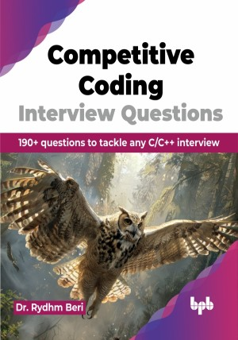

# Competitive Coding Interview Questions

190+ questions to tackle any C/C++ interview.

This is the repository for [Competitive Coding Interview Questions
](https://bpbonline.com/products/competitive-coding-interview-questions?variant=43955221397704),published by BPB Publications.

## About the Book
In today's rapidly evolving technological landscape, staying competitive in the field of software development requires a deep understanding of fundamental programming concepts and the ability to solve complex problems efficiently. This book aims to be your comprehensive guide to acing technical interviews in C, C++, data structures, and database management systems (DBMS).

The journey to becoming a proficient software engineer is often paved with rigorous technical interviews that test your knowledge, problem-solving abilities, and coding skills. This book compiles a wide range of interview questions and answers, providing you with the insights and practice needed to excel in any technical interview.

Each chapter includes a series of questions that range from basic to advanced levels. The questions are designed to test various aspects of your knowledge and problem-solving skills. Detailed solutions and explanations are provided to help you understand the reasoning behind each answer.

## What You Will Learn
• Advanced topics about C, C++, DBMS, and data structures.

• Understand pointers, including pointer arithmetic and multi-level pointers.

• Utilize templates and the Standard Template Library (STL) for generic and efficient code.

• Clear and concise explanations of concepts with examples.

• Algorithmic thinking and problem-solving techniques specific to data structures and algorithms.
